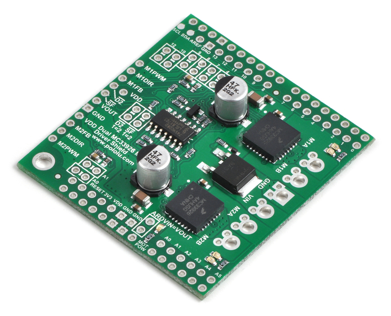
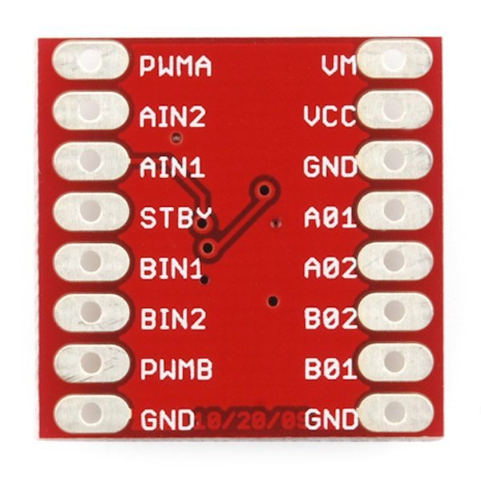

# robot-fun

Cabling
===================

Red robot
-------------
Uses the MC33926 Motor Driver Shield (the green one) 

Uses the **TinkerRobotRed** class to define **md** object
```
...
TinkerRobotRed md;
...
```

First of all put the shield on the Arduino

### Ultrasound sensor (the eyes)
Arduino (shield)| Sensor
-------- | ---
VDD | +5V
GND | GND
2 | Trig
3 | Echo

### Motor driver
Arduino (shield) | Right motor | Left motor | Battery
-------- | --- | ---
M1A | GND
M1B | VCC
GND |  |  | GND
VIN |  |  | +6V
M2A |  | GND
M2B |  | VCC

Blue robot
-------------
Uses the TB6612FNG.jpg Motor Driver (the red one) 

Uses the **TinkerRobotBlue** class to define **md** object
```
...
TinkerRobotBlue md;
...
```

### Ultrasound sensor (the eyes)
Arduino | Sensor
-------- | ---
+5V | +5V
GND | GND
2 | Trig
3 | Echo

### Motor driver
Arduino | Motor Driver | Right motor | Left motor | Battery
-------- | ---
VIN | VM |  |  | +6V
+5V | VCC
- | A01 | VCC
- | A02 | GND
- | B01 |  | VCC
- | B02 |  | GND
GND | GND |  |  | GND
5 | PWMA
6 | PWMB
7 | AIN2
8 | AIN1
10 | STBY
12 | BIN2
13 | BIN1

